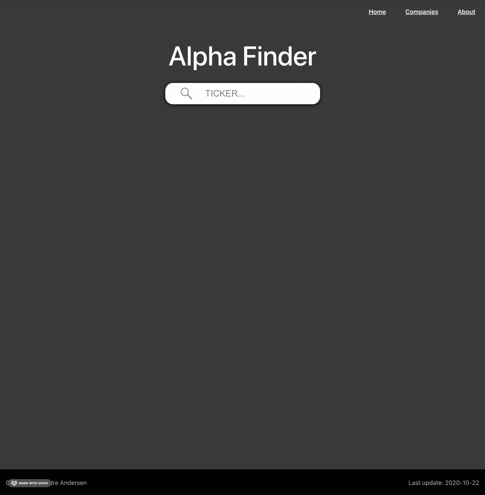

# Stock Price Dashboard 

This is a simple stock price dashboard created using React with Flask as the backend API ([which can be found here](https://github.com/sondreandersen96/obx_chart_back_end)).

## Demo
I have yet to find a good way to host this website, but the short film below should give a quick demo of how to site works. 

## Story 
This is the first real project I have created using the REACT framework. Although this is a simple website, I have learned a lot about the REACT framework, both also about JavaScript and Web development in general.

## Created by
Both code and design is created by myself, Sondre Andersen. 

